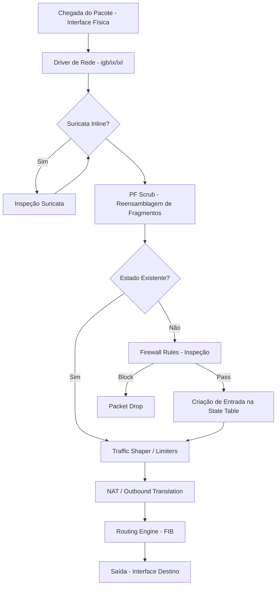

# 🧠 Deep Dive: Arquitetura Interna & Fluxo de Pacotes

Para dominar o pfSense, é necessário entender como o kernel do FreeBSD e o filtro de pacotes `pf` interagem. Este guia detalha o funcionamento interno do sistema.

---

## 1. A Vida de um Pacote (Life of a Packet)

Quando um pacote chega a uma interface física do pfSense, ele segue uma jornada rigorosa antes de ser encaminhado ou descartado.

### Detalhes Técnicos:
*   **PF Scrub:** O pfSense utiliza o comando `scrub` por padrão para normalizar pacotes, prevenindo ataques de fragmentação e removendo opções TCP inválidas.
*   **Stateful Inspection:** Uma vez que o primeiro pacote de uma conexão é permitido pelas regras, os pacotes subsequentes (em ambas as direções) são processados pela **State Table**, que é muito mais rápida do que re-avaliar todas as regras.

---

## 2. Otimização do Filtro de Pacotes (pf)

### State Table Tuning
Em ambientes com milhões de conexões (ex: ISP ou grandes DMZs), a tabela de estados pode atingir o limite.
*   **Memory Usage:** Cada estado consome cerca de 1KB de RAM.
*   **Tuning:** `System > Advanced > Firewall & NAT > Firewall Maximum States`.
    *   *Regra de bolso:* 1.000.000 estados = 1GB de RAM dedicada.

### Firewall Optimization Algorithms
*   **Normal (Default):** Equilíbrio entre performance e segurança.
*   **High Latency:** Ideal para links satélite (Starlink/HughesNet), aumenta os timeouts.
*   **Aggressive:** Remove estados inativos mais rápido da memória.

---

## 3. Kernel & Network Stack (O "Motor")

O pfSense 2.8+ no FreeBSD 14+ traz melhorias massivas no processamento multi-core.

### NMBCLUSTERS
O limite de buffers de rede. Se você vir erros de "mbuf" nos logs, deve aumentar este valor nos Tunables:
*   `kern.ipc.nmbclusters`: Define o número de clusters de rede. Para redes 10G, valores como `1000000` são comuns.

### Interrupt Coalescing
Ajustar como a placa de rede interrompe a CPU pode reduzir o uso de processador sob carga extrema, mas aumenta levemente a latência.

---
*Dica: Utilize o comando `pfctl -si` no shell para ver estatísticas detalhadas do motor do firewall em tempo real.*
