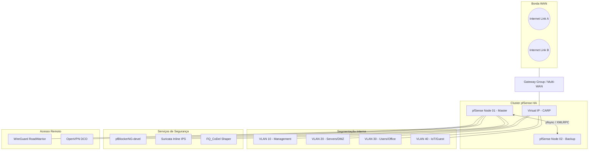

# 🛡️ pfSense Enterprise Architecture (v2.8+)

Bem-vindo ao repositório de arquitetura e infraestrutura como documentação (IaD) do nosso ambiente pfSense. Este repositório serve como a **Única Fonte da Verdade** para todas as configurações de rede, segurança e alta disponibilidade.

## 🏗️ Visão Geral da Topologia (Enterprise)

Esta topologia reflete um ambiente de alta disponibilidade (HA) com Multi-WAN, segmentação via VLANs e serviços de borda avançados.

## 🚀 Tecnologias e Padrões (pfSense 2.8+)

### 📡 Core Networking
*   **Kea DHCP:** Implementação moderna de DHCP substituindo o antigo ISC DHCP.
*   **DNS over TLS (DoT):** Privacidade máxima via Unbound, resolvendo contra Cloudflare/Google via porta 853.
*   **Dynamic Routing:** BGP e OSPF gerenciados via pacote **FRR** para redundância dinâmica.

### 🛡️ Segurança de Borda
*   **Suricata (Inline IPS):** Inspeção de pacotes em tempo real utilizando modo Netmap para menor latência.
*   **pfBlockerNG-devel:** Filtragem de IP/DNS baseada em inteligência de ameaças e GeoIP.
*   **FQ_CoDel Limiters:** Modelagem de tráfego para eliminar o *bufferbloat* e garantir latência estável sob carga.

### 🔐 VPN & Conectividade
*   **OpenVPN DCO:** Kernel-mode acceleration (Data Channel Offload) para performance Gigabit.
*   **WireGuard:** Conexões ultra-rápidas e modernas utilizando ChaCha20-Poly1305.
*   **IPsec VTI:** Túneis baseados em rota para facilitar o roteamento dinâmico.

### ⚖️ Alta Disponibilidade (HA)
*   **CARP:** Redundância de IP virtual com failover automático em menos de 1 segundo.
*   **pfsync:** Sincronização em tempo real da tabela de estados entre os nós do cluster.
*   **HAProxy:** Balanceamento de carga de aplicação (Layer 7) com terminação SSL via ACME.

## 📂 Estrutura do Repositório

| Diretório | Descrição |
| :--- | :--- |
| [`/dhcp-dns`](./dhcp-dns) | Configurações Kea DHCP e Unbound Resolver. |
| [`/routing`](./routing) | Gateway Groups, BGP/OSPF (FRR) e Rotas Estáticas. |
| [`/firewall-rules`](./firewall-rules) | Políticas de tráfego segmentadas por VLAN. |
| [`/high-availability`](./high-availability) | Configuração de CARP, XMLRPC Sync e Failover. |
| [`/vpn-openvpn`](./vpn-openvpn) | Acesso Road Warrior com aceleração DCO. |
| [`/wireguard`](./wireguard) | Túneis modernos e Site-to-Site. |
| [`/haproxy`](./haproxy) | Reverse Proxy, ACLs e Load Balancing. |
| [`/pfblockerng`](./pfblockerng) | Listas de bloqueio IP/DNS e GeoIP. |
| [`/ids-ips`](./ids-ips) | Regras do Suricata e modo Inline. |
| [`/traffic-shaping`](./traffic-shaping) | Limiters FQ_CoDel contra Bufferbloat. |
| [`/logs-monitoring`](./logs-monitoring) | Coleta de métricas e syslog centralizado. |
| [`/monitoring/dashboards`](./monitoring/dashboards) | Templates JSON para Grafana Dashboard. |
| [`/templates`](./templates) | Arquivos XML sanitizados para importação. |
| [`/scripts`](./scripts) | Scripts de automação e sanitização. |
| [`/ansible`](./ansible) | Playbooks para automação via IaC. |
| [`/lab-guides`](./lab-guides) | Guia de montagem de ambiente de teste. |
| [`.github/workflows`](./.github/workflows) | Automação CI/CD (NetDevOps). |

## 📚 Guias Avançados, Master & Transcendentes

*   [**🔒 Hardening Guide**](./HARDENING.md): Segurança extrema e otimização de kernel.
*   [**📜 Compliance & Audit**](./COMPLIANCE.md): Padrões PCI-DSS, HIPAA e auditoria.
*   [**🚑 Troubleshooting Playbook**](./TROUBLESHOOTING.md): Guia de resolução de problemas e diagnósticos.
*   [**🌪️ Disaster Recovery Plan**](./DISASTER_RECOVERY.md): Plano de recuperação de desastres (DRP).
*   [**🏢 SD-WAN Strategy**](./SD_WAN.md): Gestão avançada de links e SLAs.
*   [**🤖 AI-Driven SecOps**](./AI_SECOPS.md): Uso de IA para análise de logs e resposta.
*   [**🗺️ Multi-Vendor Interop**](./INTEROP.md): Conectando pfSense com FortiGate, Cisco e outros.
*   [**📖 Official Ref. Guide**](./OFFICIAL_DOCUMENTATION.md): Visão geral das funções nativas.
*   [**🖥️ Virtualization & Cloud**](./VIRTUALIZATION.md): Melhores práticas para Proxmox, ESXi e Nuvem.
*   [**🛡️ CrowdSec Guide**](./CROWDSEC.md): Implementação de IPS colaborativo.
*   [**🕸️ Tailscale Mesh VPN**](./TAILSCALE.md): Rede mesh Zero Trust moderna.
*   [**🏛️ Enterprise Auth**](./ENTERPRISE_AUTH.md): Integração com RADIUS, LDAP e AD.
*   [**⚙️ Hardware & Sizing**](./HARDWARE_GUIDE.md): Guia de dimensionamento e escolha de NICs.
*   [**⚡ CLI Cheat Sheet**](./CHEATSHEET.md): Comandos essenciais para Power Users.
*   [**🎓 Learning Path**](./LEARNING_PATH.md): Roteiro para certificação e maestria.
*   [**🗺️ IP Plan Guide**](./IP_PLAN.md): Estratégia de endereçamento e subnets.

## 🧠 Deep Dives Técnicos (Extremo)

Para engenheiros que buscam o domínio total do sistema:
*   [**⚙️ Core Architecture**](./CORE_ARCHITECTURE_DEEP_DIVE.md): Fluxo de pacotes no kernel e tuning do FreeBSD.
*   [**📡 DHCP & DNS Deep Dive**](./dhcp-dns/DEEP_DIVE.md): Internais do Kea e performance de Unbound.
*   [**⚖️ High Availability Deep Dive**](./high-availability/DEEP_DIVE.md): A matemática do CARP e sincronização de estados.
*   [**🔐 VPN Performance Deep Dive**](./vpn-openvpn/DEEP_DIVE.md): OpenVPN DCO, WireGuard e aceleração de hardware.
*   [**🚦 Traffic Shaping Deep Dive**](./traffic-shaping/DEEP_DIVE.md): FQ_CoDel, Limiters e mitigação de bufferbloat.
*   [**🔄 HAProxy & Security Deep Dive**](./haproxy/DEEP_DIVE.md): Anti-DDoS Layer 7 e otimização SSL.

---
**Alexandre Basto** · © 2026 · *Infraestrutura como Documentação.*
