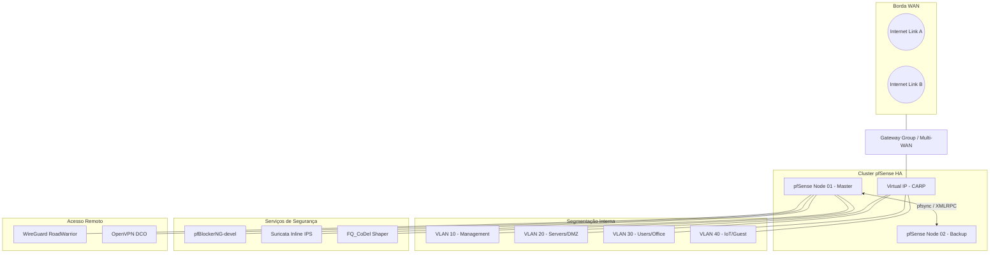

# 🛡️ pfSense Enterprise Architecture (v2.8+)

Bem-vindo ao repositório de arquitetura e infraestrutura como documentação (IaD) do nosso ambiente pfSense. Este repositório serve como a **Única Fonte da Verdade** para todas as configurações de rede, segurança e alta disponibilidade.

## 🏗️ Visão Geral da Topologia (Enterprise)

Esta topologia reflete um ambiente de alta disponibilidade (HA) com Multi-WAN, segmentação via VLANs e serviços de borda avançados.

## 🚀 Tecnologias e Padrões (pfSense 2.8+)

### 📡 Core Networking
*   **Kea DHCP:** Implementação moderna de DHCP substituindo o antigo ISC DHCP.
*   **DNS over TLS (DoT):** Privacidade máxima via Unbound, resolvendo contra Cloudflare/Google via porta 853.
*   **Dynamic Routing:** BGP e OSPF gerenciados via pacote **FRR** para redundância dinâmica.

### 🛡️ Segurança de Borda
*   **Suricata (Inline IPS):** Inspeção de pacotes em tempo real utilizando modo Netmap para menor latência.
*   **pfBlockerNG-devel:** Filtragem de IP/DNS baseada em inteligência de ameaças e GeoIP.
*   **FQ_CoDel Limiters:** Modelagem de tráfego para eliminar o *bufferbloat* e garantir latência estável sob carga.

### 🔐 VPN & Conectividade
*   **OpenVPN DCO:** Kernel-mode acceleration (Data Channel Offload) para performance Gigabit.
*   **WireGuard:** Conexões ultra-rápidas e modernas utilizando ChaCha20-Poly1305.
*   **IPsec VTI:** Túneis baseados em rota para facilitar o roteamento dinâmico.

### ⚖️ Alta Disponibilidade (HA)
*   **CARP:** Redundância de IP virtual com failover automático em menos de 1 segundo.
*   **pfsync:** Sincronização em tempo real da tabela de estados entre os nós do cluster.
*   **HAProxy:** Balanceamento de carga de aplicação (Layer 7) com terminação SSL via ACME.

## 📂 Estrutura do Repositório

| Diretório | Descrição |
| :--- | :--- |
| [`/dhcp-dns`](./dhcp-dns) | Configurações Kea DHCP e Unbound Resolver. |
| [`/routing`](./routing) | Gateway Groups, BGP/OSPF (FRR) e Rotas Estáticas. |
| [`/firewall-rules`](./firewall-rules) | Políticas de tráfego segmentadas por VLAN. |
| [`/high-availability`](./high-availability) | Configuração de CARP, XMLRPC Sync e Failover. |
| [`/vpn-openvpn`](./vpn-openvpn) | Acesso Road Warrior com aceleração DCO. |
| [`/wireguard`](./wireguard) | Túneis modernos e Site-to-Site. |
| [`/haproxy`](./haproxy) | Reverse Proxy, ACLs e Load Balancing. |
| [`/pfblockerng`](./pfblockerng) | Listas de bloqueio IP/DNS e GeoIP. |
| [`/ids-ips`](./ids-ips) | Regras do Suricata e modo Inline. |
| [`/traffic-shaping`](./traffic-shaping) | Limiters FQ_CoDel contra Bufferbloat. |

---
**Alexandre Basto** · © 2026 · *Infraestrutura como Documentação.*
