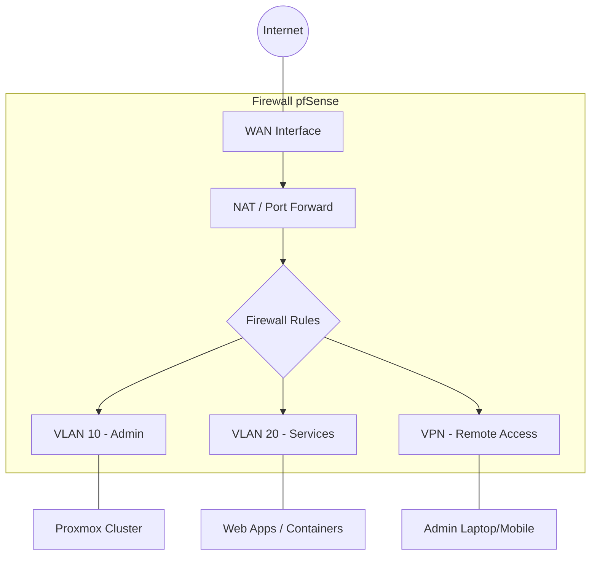

# 🛡️ Arquitetura e Configurações - pfSense

Este repositório é a "Fonte da Verdade" para a infraestrutura de rede. Ele documenta não apenas as regras, mas a inteligência por trás do tráfego e segurança.

## 🗺️ Topologia de Rede (Lógica)

## 📂 Estrutura Avançada

*   `📂 /firewall-rules` - Políticas de tráfego entre segmentos.
*   `📂 /nat` - Mapeamento de portas e regras de saída.
*   `📂 /vpn-ipsec` - Túneis Site-to-Site (Interligação de filiais/nuvem).
*   `📂 /vpn-openvpn` - Acesso seguro Road Warrior.
*   `📂 /pfblockerng` - Inteligência de ameaças e filtragem DNS.
*   `📂 /diagrams` - Arquivos fonte de diagramas (Ex: .drawio, .puml).
*   `📂 /templates` - Arquivos de configuração XML (sanitizados) para replicação.
*   `📂 /scripts` - Automações via Shell ou API (PHP/Python).

## 🚀 Padrões Técnicos

1.  **Nomenclatura:** Regras de firewall devem seguir o padrão `[ORIGEM] para [DESTINO] - [SERVIÇO] (Ticket/Data)`.
2.  **Aliases:** Nunca usar IPs fixos diretamente nas regras. Utilize **Aliases** para facilitar a manutenção.
3.  **Logging:** Todas as regras de bloqueio (Deny) devem ter o log habilitado para auditoria.
4.  **Sanitização:** Use o script de limpeza antes de subir qualquer `.xml`.

---
**Alexandre Basto** · © 2026 · *Infraestrutura como Documentação.*
