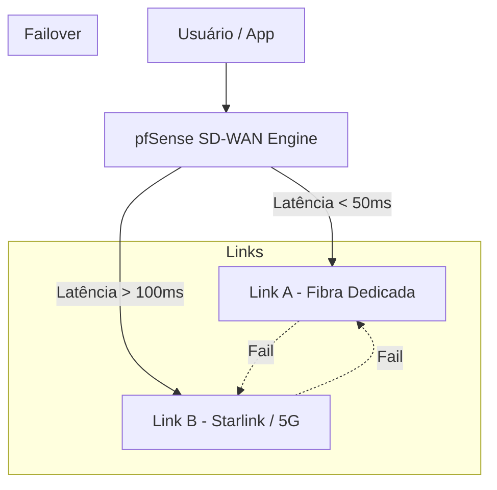

# 🏢 SD-WAN Avançado & Gestão de Links

No pfSense, o SD-WAN é implementado através da combinação de **Gateway Groups**, **Policy Routing** e **FRR**.

---

## 1. Roteamento Baseado em Aplicação (Application-Aware)

A estratégia consiste em direcionar o tráfego com base na sua natureza, não apenas no destino.

*   **Tráfego Crítico (VoIP, Zoom, Teams):** Priorizar link de menor latência (ex: Fibra Dedicada).
*   **Tráfego de Massa (HTTPS, Updates, Backup):** Utilizar link de maior banda e menor custo (ex: Starlink ou Cabo).
*   **Tráfego de Guest:** Forçar para o link de menor prioridade.

---

## 2. Monitoramento de SLA (Service Level Agreement)

Configuramos o pfSense para trocar de link não apenas quando ele cai, mas quando a qualidade degrada.

*   **Packet Loss:** Se > 2%, trocar o tráfego crítico para o link secundário.
*   **Latency (RTT):** Se a latência exceder 150ms, mover tráfego sensível.

---

## 📊 Estrutura de SD-WAN

## 3. Integração com FRR (BGP/OSPF)
Utilizar o roteamento dinâmico para que, em caso de queda de um link VPN (IPsec VTI), o tráfego seja redirecionado automaticamente por outro túnel ou link disponível.

---
*Dica: Utilize "Sticky Connections" no pfSense para evitar que sessões de banco ou logins caiam quando o SD-WAN alterna entre links.*
