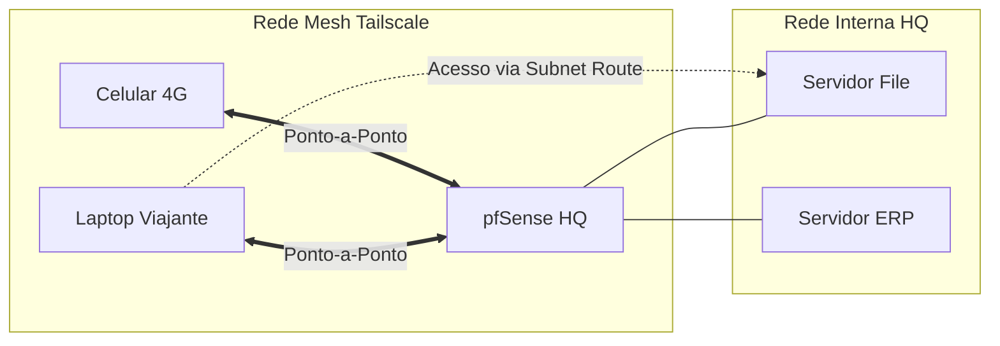

# 🕸️ Tailscale: Mesh VPN Zero Trust

O **Tailscale** no pfSense permite criar uma rede privada segura entre dispositivos, servidores e nuvens sem a necessidade de configurar regras complexas de NAT ou IPsec.

---

## 🚀 Por que usar Tailscale no pfSense?

1.  **NAT Traversal:** Funciona atrás de CGNAT ou firewalls restritivos.
2.  **Exit Node:** Você pode rotear todo o tráfego do seu celular/laptop através do pfSense (ideal para Wi-Fi público).
3.  **Subnet Routing:** O pfSense atua como gateway para sua rede interna (ex: acessar IPs `10.0.0.x` pela VPN).

---

## ⚙️ Configuração (Passo a Passo)

### 1. Instalação
*   Instalar o pacote `Tailscale` via Package Manager.
*   Autenticar o pfSense no seu Tailnet (via comando no Shell ou interface).

### 2. Subnet Router
Para permitir que outros dispositivos na rede Mesh acessem sua LAN:
*   No pfSense: Adicionar as subnets locais (ex: `10.0.0.0/24`) nas configurações do Tailscale.
*   No Admin Console do Tailscale: Aprovar as rotas enviadas pelo pfSense.

### 3. Exit Node (Opcional)
*   Ativar "Advertise as Exit Node" nas configurações do pfSense.
*   Aprovar no painel do Tailscale.

---

## 📊 Arquitetura Mesh

## 🛡️ Firewall & Segurança
*   O Tailscale cria uma nova interface chamada `tailscale0`.
*   Crie regras na interface **Tailscale** no pfSense para controlar o que os dispositivos da VPN podem acessar internamente.

---
*Dica: O Tailscale utiliza WireGuard sob o capô, garantindo performance excepcional e baixo consumo de bateria em dispositivos móveis.*
