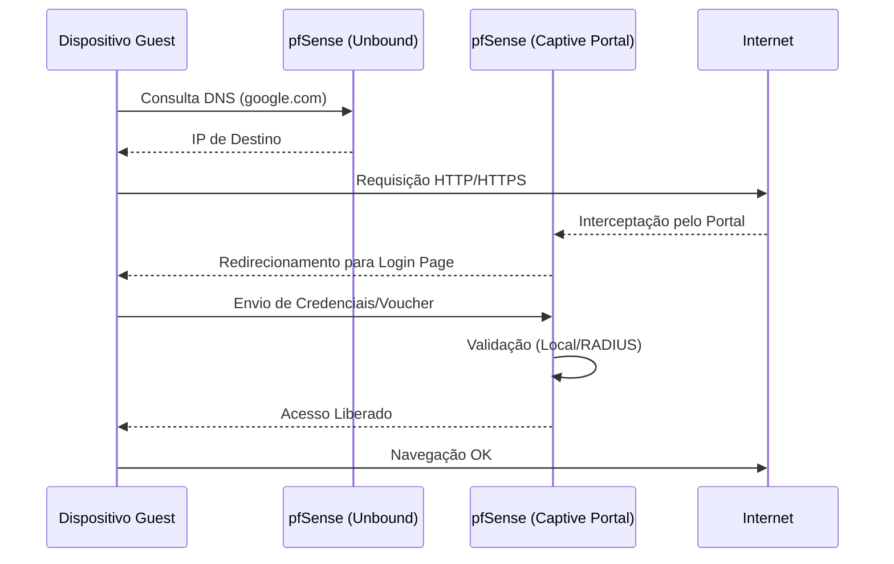

# 🌐 Captive Portal: Gestão de Acesso de Visitantes

O **Captive Portal** é a solução para controlar o acesso de dispositivos à rede através de uma página de login, ideal para redes Guest, Hotéis e Wi-Fi público.

---

## ⚙️ Configurações do Portal
*   **Interface:** Geralmente aplicada na VLAN de Guest/WiFi.
*   **Auth Method:** Local User Manager, RADIUS ou Vouchers.
*   **Idle Timeout:** Tempo após o qual o usuário é desconectado se não houver tráfego.
*   **Hard Timeout:** Tempo total máximo da sessão.
*   **Concurrent User Sessions:** Limitar a uma sessão por usuário para evitar compartilhamento de senhas.

## 🎫 Sistema de Vouchers
Utilizado para gerar códigos temporários (ex: acesso por 2 horas).
*   **Roll:** Grupo de vouchers.
*   **Tickets per Roll:** Quantidade de códigos.

---

## 📊 Fluxo de Autenticação

## 🛠️ Template XML
O arquivo `template_captive_portal.xml` contém a estrutura básica para ativação do portal com autenticação local.

---
*Dica: Para evitar problemas com sites HTTPS que não redirecionam, utilize o suporte a HTTPS no portal com um certificado válido via ACME.*
