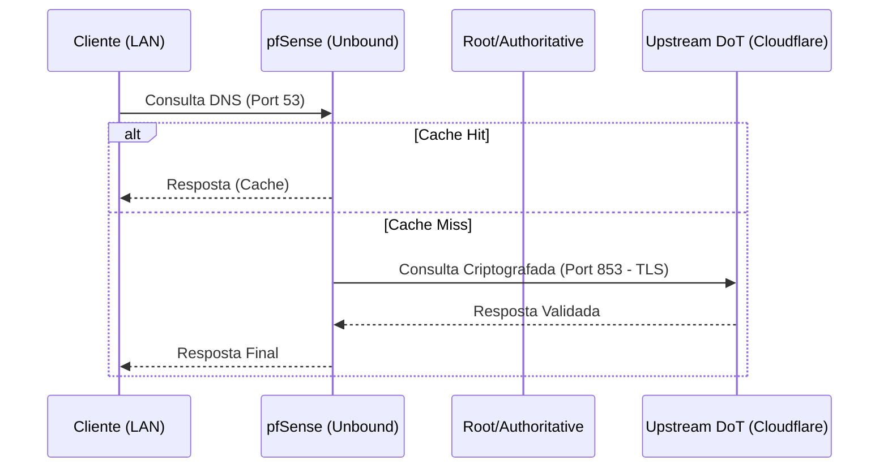

# 📡 Core Services: DHCP & DNS

Esta seção documenta a configuração dos serviços fundamentais de atribuição de rede e resolução de nomes, focando em padrões modernos de performance e privacidade.

## 🟢 Kea DHCP (Modern)

A partir do pfSense 2.7.1+/2.8+, o **Kea DHCP** substitui o antigo servidor ISC DHCP. Ele oferece uma arquitetura baseada em API, mais escalável e robusta.

### Configurações Gerais
*   **Interface:** LAN, VLANs (Segmentadas).
*   **Range de IPs:** Reservar 20% do prefixo para pools dinâmicos, o restante para mapeamentos estáticos.
*   **DNS Servers:** Apontar para o Virtual IP (CARP) ou IP local da interface (para Unbound).
*   **Gateways:** Definir o VIP (CARP) se em cluster HA.

### Mapeamentos Estáticos (Static Leases)
*   **Padrão:** Sempre definir `Hostname` para permitir a resolução interna via DNS Resolver.
*   **Nomenclatura:** `[SVR|DEV|USR]-[ID]-[SETOR]`. Ex: `SVR-01-PROXMOX`.

---

## 🔒 DNS Resolver (Unbound)

Utilizamos o **Unbound** para resolução recursiva local com foco em segurança e privacidade.

### ⚙️ Configurações de Performance & Segurança
*   **DNSSEC:** [X] Habilitado (Garante integridade das respostas).
*   **DNS Over TLS (DoT):** [X] Habilitado.
    *   **Upstreams:**
        *   `1.1.1.1` (Cloudflare) @ 853 - `cloudflare-dns.com`
        *   `8.8.8.8` (Google) @ 853 - `dns.google`
*   **Query Forwarding:** Habilitado apenas para DoT.
*   **DHCP Registration:** Habilitado (Registra automaticamente hosts DHCP no DNS).
*   **Static Mapping Registration:** Habilitado.

### 🛡️ Hardening do DNS
1.  **Strict ACLs:** Apenas subnets internas podem realizar consultas recursivas.
2.  **Infrastructure Overrides:** Domínios internos (ex: `.internal` ou `.lan`) devem ser resolvidos localmente.
3.  **DNS Rebinding Protection:** Habilitado para evitar ataques de redirecionamento.

---

## 📊 Fluxo de Resolução DNS

---
*Nota: Se o cluster for HA, as configurações de DHCP/DNS são sincronizadas automaticamente via XMLRPC Sync.*
