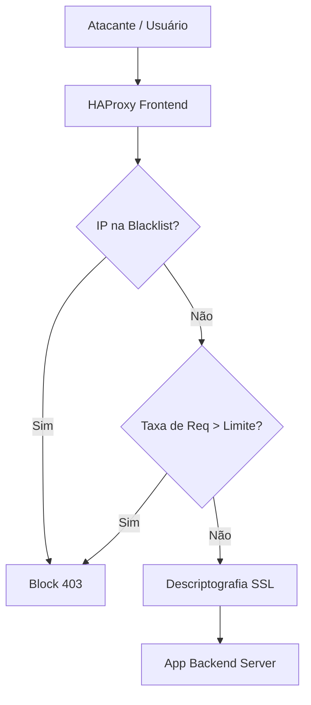

# 🔄 Deep Dive: HAProxy & Anti-DDoS Layer 7

O HAProxy no pfSense não é apenas um proxy reverso; ele é um motor de segurança de borda capaz de mitigar ataques complexos na Camada 7.

---

## 1. Anti-DDoS com Stick Tables

O HAProxy utiliza **Stick Tables** para rastrear o comportamento dos clientes e aplicar limites de taxa (Rate-Limiting).

### ⚙️ Implementação de Proteção
Podemos configurar o HAProxy para bloquear IPs que:
*   Realizam mais de 20 conexões simultâneas.
*   Solicitam mais de 50 requisições em 10 segundos.
*   Geram muitos erros 404 (tentativa de diretório brute-force).

**Lógica ACL:**
```haproxy
http-request track-sc0 src
http-request deny if { sc0_http_req_rate(be_app) gt 100 }
```

---

## 2. SSL/TLS Deep Optimization

Para performance máxima e segurança (Nota A+ no SSLLabs):

*   **OCSP Stapling:** O HAProxy envia a prova de que o certificado não foi revogado, economizando um RTT para o cliente.
*   **Diffie-Hellman Parameters:** Gerar um arquivo DH de 2048 ou 4096 bits customizado (`System > Advanced > Admin Access`).
*   **Ciphers Modernos:**
    ```text
    ECDHE-ECDSA-AES256-GCM-SHA384:ECDHE-RSA-AES256-GCM-SHA384:ECDHE-ECDSA-CHACHA20-POLY1305
    ```

---

## 3. Lua Scripting (Opcional)

O HAProxy no pfSense permite a integração de scripts **Lua**. Isso possibilita:
*   Verificação de bots em tempo real.
*   Integração com bases de dados externas para validação de tokens.
*   Customização extrema de headers de resposta.

---

## 📊 Fluxo de Requisição Protegida



## 🛠️ Monitoramento de HAProxy
*   **Stats Page:** Sempre habilite a página de estatísticas com senha. Ela mostra o tráfego por backend, número de erros de conexão e tempo de resposta (TR).
*   **Telegraf Integration:** Envie as métricas de requisições por segundo para o Grafana para visualizar picos de tráfego.

---
*Dica: Se estiver usando o pfSense como proxy para muitos subdomínios, utilize certificados Wildcard via ACME para simplificar a gestão.*
