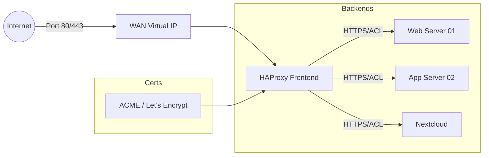

# 🔄 HAProxy: Reverse Proxy & Load Balancing

Utilizamos o **HAProxy** como controlador de entrada (Ingress) para serviços internos, realizando SSL Offloading e balanceamento de carga na Camada 7.

## 🏗️ Arquitetura de Publicação

## ⚙️ Configuração de Frontends

*   **Bind:** Listen na porta `443` (SSL) no IP Virtual (CARP) da WAN.
*   **SSL Offloading:** HAProxy gerencia os certificados. O tráfego interno entre HAProxy e Backends pode ser HTTP ou HTTPS (re-encrypt).
*   **HSTS:** [X] Habilitado (Garante que o navegador use apenas HTTPS).
*   **OCSP Stapling:** [X] Habilitado (Performance de validação de certificado).

## 🛡️ ACLs (Access Control Lists)

As ACLs são usadas para rotear o tráfego com base no `Host` (FQDN) ou `Path`.

| Nome ACL | Condição (Host) | Backend Destino |
| :--- | :--- | :--- |
| `acl_nextcloud` | `cloud.empresa.com` | `be_nextcloud` |
| `acl_webapp` | `app.empresa.com` | `be_webapp` |
| `acl_api` | `api.empresa.com` | `be_api_cluster` |

## 🎛️ Configuração de Backends

*   **Load Balancing Algorithm:** `Round Robin` ou `Least Connections`.
*   **Health Checks:** `HTTP Check` (Validar se o `/` retorna status 200).
*   **Sticky Sessions:** Habilitar se a aplicação não for stateless (usar `Appsession` ou `Cookie`).

---

## 🔒 Hardening HAProxy
1.  **Ciphers:** Utilizar apenas `Intermediate` ou `Modern` (Mozilla SSL Config).
2.  **Max Connections:** Limitar por backend para evitar exaustão de recursos.
3.  **Error Files:** Personalizar páginas de erro 503/404 para evitar exposição de versões de servidor.

---
*Dica: Utilize a aba `Stats` do HAProxy para monitorar o tráfego em tempo real e o estado dos servidores backend.*
