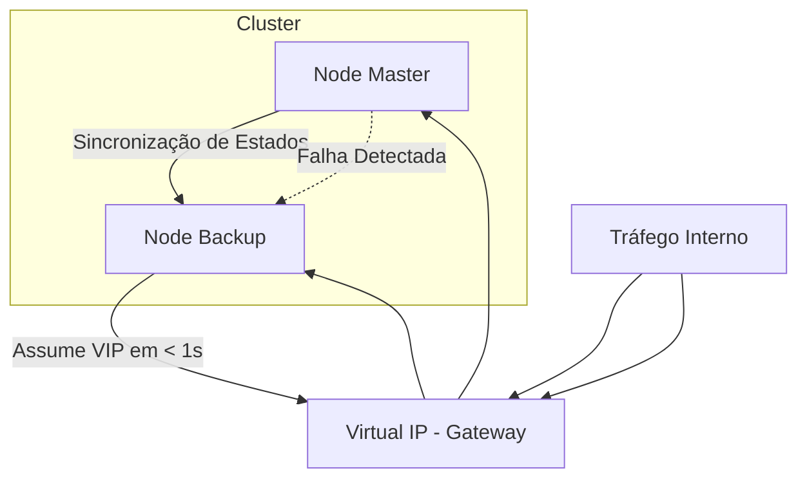

# ⚖️ Alta Disponibilidade (HA) & Redundância

Configuração de cluster Ativo/Passivo para garantir disponibilidade 99.99% dos serviços de rede.

## 🧱 Componentes do Cluster

O cluster pfSense HA baseia-se em três tecnologias principais:

1.  **CARP (Common Address Redundancy Protocol):** Gerencia IPs Virtuais (VIPs) que flutuam entre os nós.
2.  **pfsync:** Sincroniza a tabela de estados (states) do firewall, garantindo que as conexões não caiam durante o failover.
3.  **XMLRPC Sync (Config Sync):** Sincroniza automaticamente as configurações (regras, aliases, VPNs, etc.) do nó Master para o nó Backup.

---

## ⚙️ Configuração dos Nós

| Recurso | Nó 01 (Master) | Nó 02 (Backup) | IP Virtual (CARP) |
| :--- | :--- | :--- | :--- |
| **IP LAN** | `10.0.0.2` | `10.0.0.3` | `10.0.0.1` |
| **IP WAN** | `200.1.1.2` | `200.1.1.3` | `200.1.1.1` |
| **IP SYNC** | `172.16.0.1` | `172.16.0.2` | N/A |
| **Skew** | `0` | `100` | N/A |

### 🔗 Interface de Sync (PFSYNC)
*   **Físico:** Recomendado utilizar uma conexão direta entre os dois firewalls ou uma VLAN dedicada.
*   **Regras de Firewall:** Liberar tráfego `IP Protocol PFSYNC` na interface de sincronização.

---

## 🔄 Fluxo de Failover

## 🛠️ Checklist de Implementação
- [ ] Mesma versão do pfSense em ambos os nós.
- [ ] Mesmos nomes de interfaces (ex: `igb0`, `igb1`) ou uso de `Assign Interfaces` idêntico.
- [ ] NAT Outbound configurado para usar o **IP Virtual (CARP)** da WAN em vez do IP da interface.
- [ ] XMLRPC Sync habilitado no Master apontando para o IP do Backup.

## ⚠️ Considerações Importantes
*   **DHCP em HA:** O Kea DHCP ainda possui limitações de sincronização nativa em HA comparado ao ISC. Validar o status atual da documentação Netgate para replicação de leases.
*   **Packages:** Alguns pacotes (ex: FRR, ntopng) exigem configurações específicas para rodar em modo HA.

---
*Status: O cluster deve ser monitorado via Dashboard e Telegraf para alertas de transição de estado CARP.*
