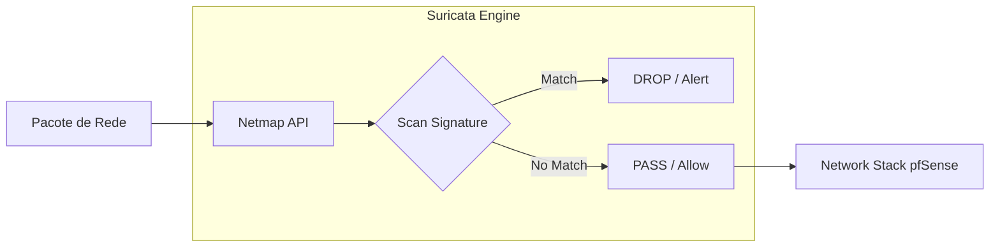

# 🛡️ IDS/IPS: Suricata (Inline Mode)

Utilizamos o **Suricata** como sistema de detecção e prevenção de intrusão, operando em modo **Inline** para mitigar ameaças em tempo real sem a necessidade de regras de bloqueio legado (Legacy Mode).

## 🚀 Configuração de Performance (Netmap)

Diferente do modo legado, o modo **Inline IPS** utiliza a API `Netmap` do FreeBSD para interceptar pacotes antes que cheguem ao stack de rede, permitindo o drop imediato sem sobrecarga.

### ⚙️ Parâmetros Globais
*   **Interface:** WAN (Proteção de Borda) e DMZ (Proteção de Ativos Críticos).
*   **IPS Mode:** Inline.
*   **Checksum Pipline:** Habilitado (melhora performance em NICs modernas).
*   **Log Level:** Info (ajustar para Debug apenas em troubleshooting).

---

## 📋 Gestão de Regras (Signatures)

Ativamos feeds de alta fidelidade para minimizar falsos positivos.

### 📶 Feeds Ativos
1.  **ET Open (Emerging Threats):** Base principal de assinaturas gratuitas.
2.  **Snort VRT:** Regras da Cisco/Talos (requer registro).
3.  **Feeds Específicos:**
    *   `botcc`: Comando e Controle.
    *   `ciarmy`: IPs conhecidos por ataques.
    *   `mobile_malware`: Proteção para endpoints móveis.

---

## 🛡️ Fluxo de Detecção Inline

## 🛠️ Manutenção & Tuning
*   **Suppress List:** Utilizada para silenciar alertas de falsos positivos conhecidos sem desativar a regra globalmente.
*   **Updates:** Agendar atualização de assinaturas diariamente às 04:00 AM.
*   **Monitoramento:** Acompanhar a aba `Alerts` para identificar novas ondas de varredura ou tentativas de exploração.

---
*Cuidado: O modo Inline IPS requer placas de rede (NICs) com drivers compatíveis com Netmap (ex: Intel igb/ix/ixl).*
