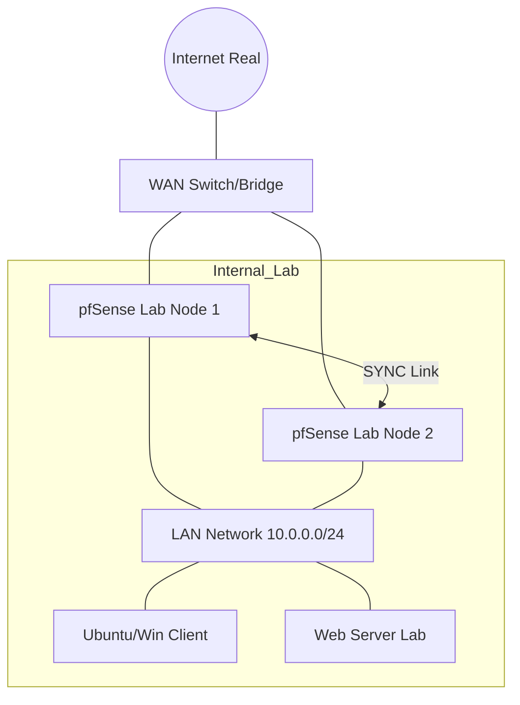

# 🧪 pfSense Lab Guide: Cenários de Teste

Guia para montar um laboratório de rede seguro e testar todas as funcionalidades deste repositório sem afetar a produção.

---

## 🏗️ Topologia de Laboratório Sugerida

Recomendamos o uso de **Proxmox VE**, **GNS3** ou **EVE-NG**.

---

## 🚀 Cenários de Teste Obrigatórios

### 1. Failover de Alta Disponibilidade (CARP)
*   **Ação:** Inicie um `ping google.com -t` no Cliente. Desligue o nó Master do pfSense.
*   **Resultado Esperado:** O nó Backup assume o VIP. O ping deve perder no máximo 1 ou 2 pacotes.

### 2. Bloqueio de Segurança (pfBlockerNG)
*   **Ação:** Tente acessar um domínio de teste conhecido por phishing ou anúncios.
*   **Resultado Esperado:** O pfSense deve redirecionar para a página de bloqueio ou retornar `0.0.0.0`.

### 3. VPN Site-to-Site (WireGuard/IPsec)
*   **Ação:** Crie uma segunda VM de pfSense simulando uma "Filial". Configure o túnel.
*   **Resultado Esperado:** O Cliente na LAN da Sede deve conseguir pingar o servidor na LAN da Filial.

---

## 🛠️ Ferramentas para o Lab

*   **Traffic Generator:** `iperf3` para testar throughput entre VLANs.
*   **Security Scanner:** `nmap` para validar regras de firewall e `Nikto` para testar o HAProxy.
*   **Log Server:** Uma pequena VM com `Syslog-ng` ou `Graylog` para testar a observabilidade.

---

## ⚠️ Dicas de Ouro
1.  **Promiscuous Mode:** No Proxmox/VMware, habilite o modo promíscuo no vSwitch para que o CARP funcione.
2.  **MAC Address:** Cada interface de pfSense no lab deve ter um endereço MAC único.
3.  **Snapshot Manual:** Antes de instalar pacotes pesados (como o ntopng), tire um snapshot.

---
*Este laboratório é a sua "Sandbox" para se tornar um mestre em pfSense.*
