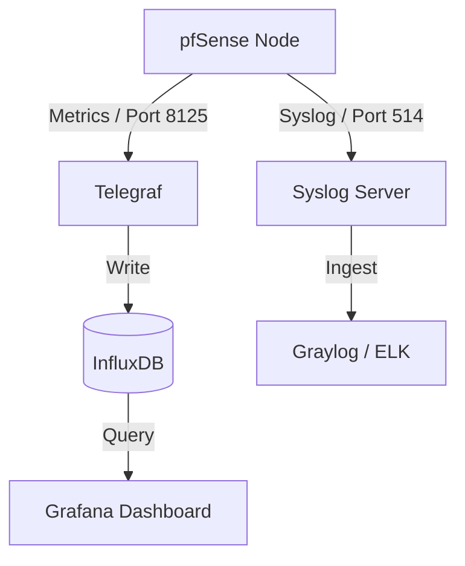

# 📊 Observabilidade: Logs & Monitoramento

Um firewall corporativo deve ser visível. Documentamos aqui como extrair e visualizar métricas de performance e logs de segurança.

## 📡 Coleta de Métricas (Telegraf)

Utilizamos o pacote **Telegraf** para enviar métricas do sistema pfSense para um stack externo (ex: InfluxDB + Grafana).

### ⚙️ Configurações do Telegraf
*   **Output:** `InfluxDB v2` ou `Prometheus Client`.
*   **Inputs Ativos:**
    *   `CPU`, `Memory`, `Swap`.
    *   `Interface Statistics` (Tráfego por interface).
    *   `Ping` (Monitoramento de latência de Gateways).
    *   `Unbound` (Performance DNS).
    *   `HAProxy` (Métricas de Backend/Frontend).

---

## 📋 Gestão de Logs (Syslog)

Logs locais são limitados por espaço. Recomendamos o envio para um servidor centralizador (SIEM/Log Management).

### ⚙️ Configuração de Remote Logging
*   **Protocolo:** UDP ou TCP (TLS recomendado para segurança).
*   **Servidor Remoto:** IP do Graylog, ELK Stack ou Splunk.
*   **Conteúdo dos Logs:**
    *   `System Events`.
    *   `Firewall Events` (Log das regras de bloqueio/passagem).
    *   `VPN Events` (Logs de conexão/desconexão).

---

## 📈 Dashboard Sugerido (Grafana)

## 🛠️ Alertas Críticos
Devem ser configurados no Grafana ou via E-mail/Telegram no pfSense:
1.  **Gateway Down:** Failover de link WAN detectado.
2.  **High CPU/RAM:** Possível ataque DoS ou exaustão de recursos.
3.  **CARP State Change:** Nó Master/Backup alternou.
4.  **IPsec/VPN Down:** Queda de interconexão entre filiais.

---
*Dica: Utilize o Dashboard oficial "pfSense Telegraf V2" no Grafana para uma visualização completa em poucos minutos.*
