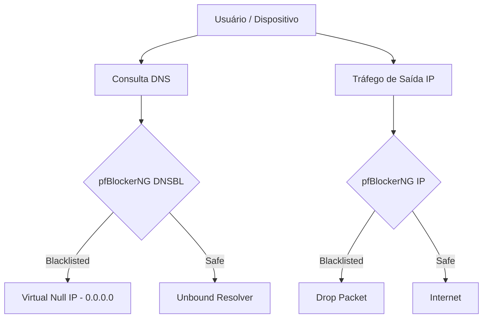

# 🚫 pfBlockerNG-devel: Inteligência de Ameaças

O **pfBlockerNG** é o principal módulo de filtragem de conteúdo e reputação de IP do pfSense, atuando tanto em nível de pacotes (IP) quanto de DNS (DNSBL).

## 🛡️ Filtragem de IP (IP Blocklists)

Bloqueio de conexões de entrada e saída baseadas em listas negras globais e reputação geográfica.

### 📋 Listas de IP Ativas
*   **PRI1 (Priority 1):** Listas de alta confiança contendo atacantes conhecidos (ex: `Spamhaus`, `CINN`, `Talos`).
*   **GeoIP:** Bloqueio total de países com os quais a empresa não faz negócios (ex: China, Rússia, Coréia do Norte para portas administrativas).
*   **Tor Nodes:** Bloqueio de saída/entrada para a rede Tor em redes corporativas críticas.

### ⚙️ Configurações de Regra
*   **Action:** `Alias Deny` ou `Alias Native` (para uso em regras customizadas).
*   **Logging:** Ativado para todas as listas de alta prioridade.

---

## 🔍 DNSBL (DNS Blacklisting)

Filtragem de nomes de domínio (FQDN) antes que a resolução IP ocorra. Substitui ferramentas como Pi-hole dentro do próprio pfSense.

### 📶 Grupos de DNSBL
1.  **Ads:** Bloqueio de telemetria e publicidade (ex: `EasyList`, `Adaway`).
2.  **Malware:** Domínios de distribuição de ransomware e phishing (ex: `URLhaus`, `PhishTank`).
3.  **SafeSearch:** Forçar navegação segura no Google/YouTube via DNS.

---

## 📊 Dashboard de Eventos

## 🛠️ Boas Práticas
*   **Update Frequency:** Configurar `Cron` para atualizar as listas a cada 12 ou 24 horas.
*   **Feeds Tuning:** Não ativar centenas de listas. Priorize qualidade sobre quantidade para não sobrecarregar a memória RAM.
*   **Whitelisting:** Sempre documentar domínios liberados manualmente na aba `DNSBL Whitelist`.

---
*Dica: Utilize o "Alerts Tab" para identificar qual lista está bloqueando um domínio legítimo e realizar o bypass rapidamente.*
