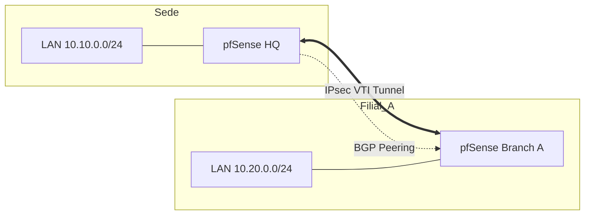

# 🛣️ Roteamento Dinâmico & Multi-WAN

Configuração de tráfego de saída, failover de links e roteamento dinâmico entre sites.

## ⚖️ Multi-WAN (Gateway Groups)

Utilizamos **Gateway Groups** para garantir redundância e balanceamento de carga de saída.

### 📶 Definição de Tiers
*   **Tier 1:** Link Fibra Principal (Maior largura de banda).
*   **Tier 2:** Link de Backup (Menor latência ou Link Terciário).
*   **Tier 3:** Link 4G/LTE de emergência.

### 🛡️ Gateway Monitoring
*   **IP de Monitoramento:** Não monitorar o IP do gateway do ISP. Utilizar IPs externos confiáveis (ex: `1.1.1.1`, `8.8.4.4`).
*   **Latency Thresholds:** Alertar e trocar de gateway se latência > 250ms ou perda de pacotes > 5%.

---

## 🚀 Roteamento Dinâmico (FRR - Free Range Routing)

Para ambientes escaláveis, utilizamos o pacote **FRR** para gerenciar BGP e OSPF.

### 🌐 BGP (Border Gateway Protocol)
*   **Uso:** Interligação com Cloud (AWS Direct Connect/Azure ExpressRoute) ou entre filiais via Túneis VTI.
*   **Configuração:**
    *   **ASN Local:** Definir conforme topologia corporativa.
    *   **Neighbors:** Configurados via IPs de túneis IPsec VTI.
    *   **Prefixes:** Anunciar apenas as subnets locais autorizadas.

### 🗼 OSPF (Open Shortest Path First)
*   **Uso:** Roteamento interno entre switches core L3 e pfSense.
*   **Area:** `0.0.0.0` (Backbone).
*   **Redistribute:** Conectadas e Estáticas (se necessário).

---

## 🗺️ Topologia de Roteamento (VTI + BGP)

## 🛠️ Policy Routing (PBR)
Regras de firewall que forçam o tráfego de hosts específicos para gateways específicos.
*   **Exemplo:** Servidores de Backup saindo apenas pelo Link de menor custo.
*   **Nota:** Sempre habilitar "Skip rules when gateway is down" nas configurações globais.

---
*Dica: Utilize o status do FRR (`Diagnostics > BGP Status`) para validar o recebimento de rotas.*
