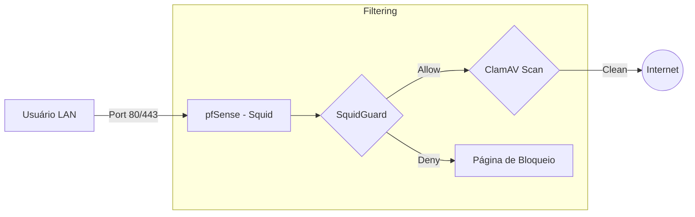

# 🦑 Squid Proxy & SquidGuard: Filtragem Web

O **Squid** é um servidor proxy de caching e filtragem que permite o controle detalhado do tráfego HTTP/HTTPS na rede.

---

## 🚀 Funcionalidades Principais
1.  **Caching:** Armazena localmente arquivos acessados com frequência para economizar banda.
2.  **SquidGuard:** Módulo de filtragem de URL baseado em categorias (Pornografia, Jogos, Redes Sociais).
3.  **ClamAV Integration:** Antivírus em tempo real para downloads realizados via proxy.

---

## 🔒 SSL Man-in-the-Middle (SSL Filtering)
Para filtrar tráfego HTTPS (porta 443), o Squid precisa interceptar a conexão.
*   **SSL Intercept:** O pfSense gera um certificado CA próprio que deve ser instalado em todos os dispositivos da rede.
*   **Transparent Proxy:** Intercepta o tráfego sem que o usuário precise configurar o proxy no navegador.

---

## 📊 Arquitetura de Proxy

## 🛠️ Template XML
O arquivo `template_squid.xml` contém a base para ativação do proxy transparente com suporte a cache básico.

---
*Atenção: O uso de SSL Intercept quebra o sigilo da conexão e pode causar problemas com aplicativos que utilizam Certificate Pinning (ex: apps bancários).*
