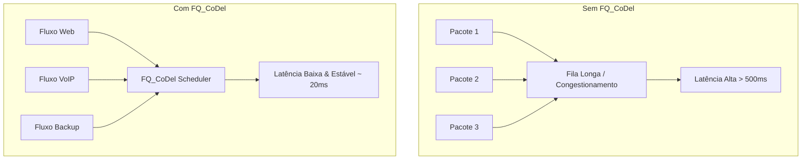

# 🚦 Traffic Shaping: FQ_CoDel & Limiters

A modelagem de tráfego moderna no pfSense 2.8+ foca na eliminação do **Bufferbloat** (latência induzida por filas saturadas) e na garantia de equidade entre os fluxos.

## 🚀 FQ_CoDel (Fair Queuing Controlled Delay)

Utilizamos **Limiters** com o escalonador **FQ_CoDel** para gerenciar a banda de forma dinâmica e justa.

### ⚙️ Configuração de Limiters (In/Out)

1.  **Limiter de Download (WAN_In):**
    *   **Bandwidth:** Definir para 95% da velocidade real do link (ex: 950 Mbit/s para link de 1 Gbps).
    *   **Schedule:** `FQ_CoDel`.
    *   **Target:** `5ms`.
    *   **Interval:** `100ms`.
2.  **Limiter de Upload (WAN_Out):**
    *   **Bandwidth:** Definir para 95% da velocidade real de upload.
    *   **Schedule:** `FQ_CoDel`.

---

## 📋 Regras de Aplicação

Os Limiters devem ser aplicados via **Regras de Firewall** ou **Floating Rules**.

*   **Interface:** WAN.
*   **Protocolo:** Any.
*   **In/Out Pipe:** Selecionar os Limiters criados (In -> Download, Out -> Upload).

---

## 📊 Impacto na Latência (Bufferbloat)

## 🛠️ Verificação de Performance
*   **Teste de Bufferbloat:** Utilizar sites como `waveform.com/tools/bufferbloat`. O objetivo é nota **A** ou **A+**.
*   **Diagnostics:** Verificar as filas em tempo real via `Diagnostics > Limiter Info`.

## ⚠️ Considerações
*   **Aceleração de Hardware:** Desativar "Hardware Large Receive Offload (LRO)" e "Hardware Checksum Offloading" se encontrar instabilidades com Limiters em certas NICs.
*   **CPU:** O FQ_CoDel é intensivo em CPU. Monitore o uso de processador durante testes de carga máxima.

---
*Dica: Para tráfego VoIP crítico, crie uma regra separada acima do Limiter geral com uma reserva de banda dedicada.*
