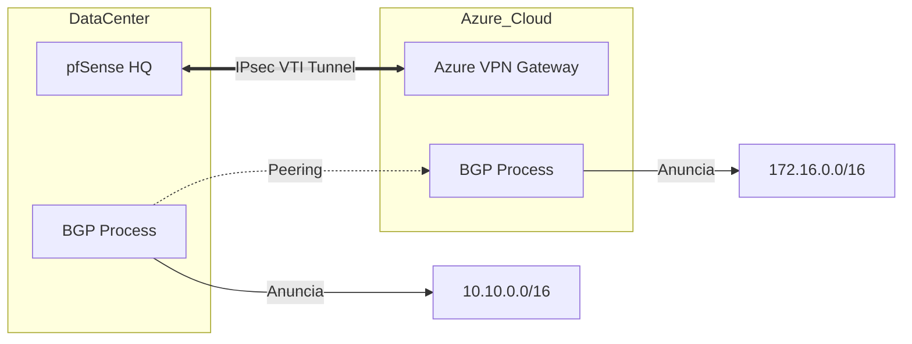

# 🏛️ IPsec: Túneis Corporativos & Route-Based (VTI)

O **IPsec** continua sendo o padrão ouro para interconexão Site-to-Site corporativa e integração com provedores de nuvem (AWS, Azure, GCP).

## 🛣️ IPsec VTI (Virtual Tunnel Interface)

Diferente do IPsec baseado em política (Policy-Based), o **VTI** cria uma interface de rede real no pfSense, permitindo:
*   Uso de protocolos de roteamento dinâmico (OSPF/BGP via FRR).
*   Regras de firewall simplificadas por interface.
*   Priorização de tráfego (QoS) no túnel.

---

## ⚙️ Configuração Fase 1 (IKEv2)

Recomendamos apenas o uso de **IKEv2** para maior segurança e estabilidade.

*   **Key Exchange:** IKEv2.
*   **Encryption:** `AES-256-GCM` (128 bits ICV).
*   **Pseudo-Random Function (PRF):** `HMAC-SHA256`.
*   **Diffie-Hellman Group:** `14 (2048 bit)` ou `19 (NIST P-256)`.
*   **Lifetime:** 28800 segundos.

---

## ⚙️ Configuração Fase 2 (ESP)

*   **Mode:** `VTI` (Route-Based).
*   **Protocol:** ESP.
*   **Encryption:** `AES-256-GCM`.
*   **PFS (Perfect Forward Secrecy):** `Off` (se GCM for usado em ambas as fases) ou `DH Group 14`.

---

## 🗺️ Fluxo de Roteamento Dinâmico via VTI

## 🛠️ Checklist de Implementação
- [ ] MSS Clamping configurado para 1350 ou inferior para evitar fragmentação.
- [ ] Regras de firewall na aba `IPsec` liberando tráfego IKE (UDP 500) e NAT-T (UDP 4500).
- [ ] Verificação de status em `Status > IPsec`.

---
*Dica: Para túneis com Azure, certifique-se de configurar o responder como "Only" ou "Both" e garantir que os grupos DH coincidam exatamente com a política da Microsoft.*
