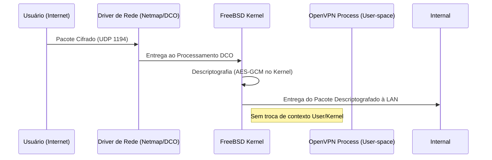

# 🔒 OpenVPN DCO: Acesso Remoto de Alta Performance

A partir do pfSense 2.8+, o OpenVPN suporta **DCO (Data Channel Offload)**, movendo o processamento de criptografia do espaço de usuário para o kernel do FreeBSD, resultando em ganhos massivos de throughput.

## 🚀 Configuração do Servidor (DCO Ready)

Para utilizar o DCO, certas restrições e configurações específicas devem ser seguidas.

### ⚙️ Parâmetros do Servidor
*   **Interface:** WAN (ou IP Virtual CARP).
*   **Protocolo:** UDP on IPv4 Only.
*   **Data Channel Offload:** [X] Habilitado.
*   **Encryption:** `AES-256-GCM` (Obrigatório para DCO).
*   **Auth:** `SHA256` ou superior.
*   **Device Mode:** `tun` (Layer 3).

### 👥 Gestão de Clientes & Auth
1.  **Backend de Autenticação:** Local Database + Certificado ou Integração LDAP/AD com MFA.
2.  **MFA:** Recomendado o uso do pacote `stunnel` ou integração RADIUS com Microsoft Authenticator/Google Authenticator.
3.  **Topology:** Subnet (um IP por cliente).

---

## 🛡️ Segurança (Hardening)

*   **TLS Key:** Habilitada e direcional (previne ataques DoS iniciais).
*   **Renegociação de Chave:** Configurada para 3600 segundos (1 hora).
*   **Strict No-Log (Opcional):** Para privacidade total, ou Verbosity 3 para auditoria.

---

## 📊 Fluxo de Conexão DCO

## 🛠️ Checklist de Implementação
- [ ] Driver de rede compatível com aceleração de kernel.
- [ ] Exportação de perfil `.ovpn` utilizando o `openvpn-client-export`.
- [ ] Regras de firewall na interface `OpenVPN` seguindo o Princípio do Menor Privilégio.

---
*Dica: O OpenVPN DCO não suporta compressão (LZO/LZ4). Desative a compressão para garantir a compatibilidade e performance.*
