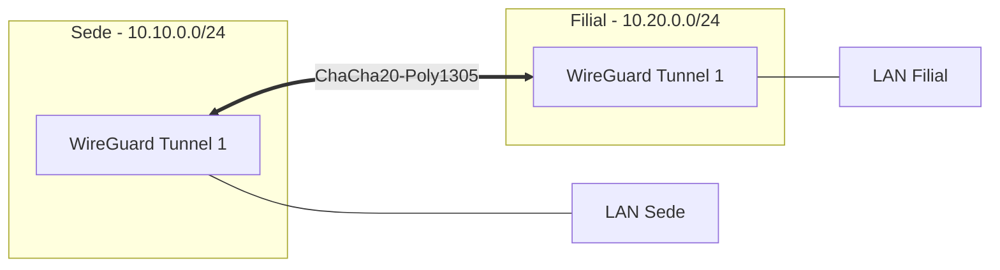

# ⚡ WireGuard: Conectividade Moderna & Ultra-Rápida

O **WireGuard** é um protocolo de VPN extremamente simples, rápido e moderno que utiliza criptografia de ponta (ChaCha20-Poly1305).

## 🏗️ Casos de Uso

1.  **Site-to-Site:** Interconexão de alta velocidade entre filiais ou com a nuvem.
2.  **Road Warrior:** Acesso remoto para administradores e usuários que exigem baixa latência.

---

## ⚙️ Configuração do Túnel (Tunnel)

*   **Listen Port:** 51820 (Padrão).
*   **Cryptography:** ChaCha20-Poly1305 (Curva elíptica 25519).
*   **MTU:** 1420 (Recomendado para evitar fragmentação em links WAN).

### 🔑 Gestão de Chaves
*   **Public Key:** Compartilhada com os peers.
*   **Private Key:** Armazenada de forma segura no pfSense (NUNCA comitar).
*   **Preshared Key (PSK):** Camada adicional de segurança contra ataques quânticos.

---

## 👥 Configuração de Peers

Cada peer (cliente ou outro firewall) deve ser cadastrado manualmente ou via automação.

| Atributo | Descrição |
| :--- | :--- |
| **Endpoint** | IP/FQDN público do peer (opcional para RoadWarrior). |
| **Allowed IPs** | Tráfego que passará pelo túnel (ex: `10.20.0.0/24` para S2S ou `0.0.0.0/0` para Full Tunnel). |
| **Keepalive** | `25` segundos (Mantém o túnel ativo através de NATs). |

---

## 🗺️ Topologia WireGuard S2S

## 🛠️ Boas Práticas
*   **Interface Group:** Adicionar as interfaces WireGuard a um grupo de interface para facilitar a criação de regras de firewall.
*   **Routing:** WireGuard no pfSense cria interfaces estáticas; utilize rotas estáticas ou **Gateway Groups** para failover.
*   **QR Code:** Utilize a geração de QR Code no pfSense para facilitar a configuração de dispositivos móveis.

---
*Nota: O WireGuard no pfSense roda como um módulo de kernel nativo, garantindo performance superior a implementações em user-space.*
